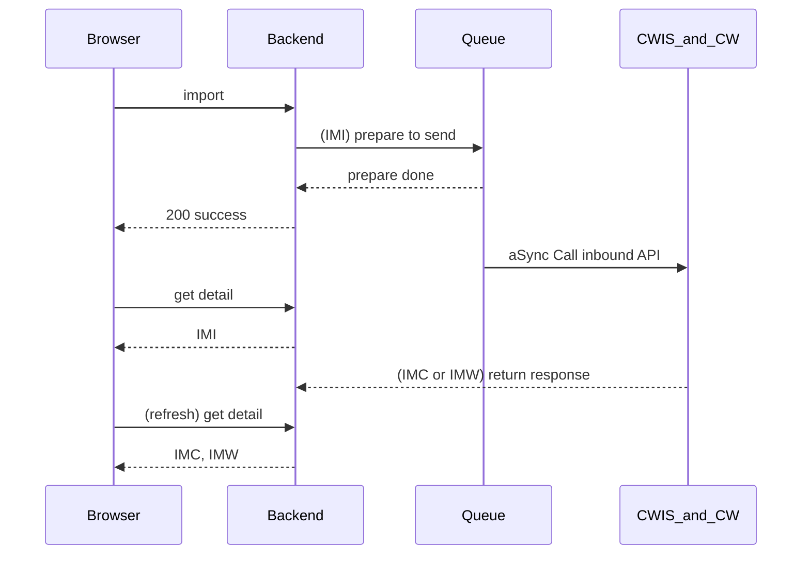
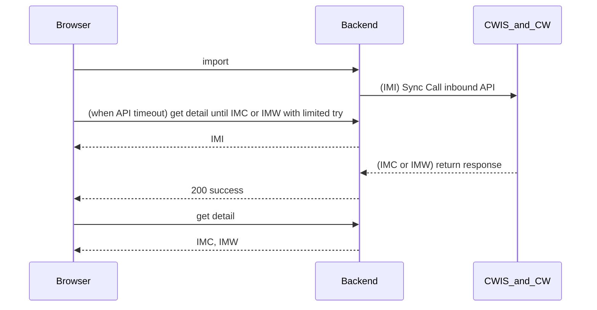

# oec-erpportal-addon-cpar
Repo for oec erpportal addon compliance AR APIs

##Technologies
1. Token Service
2. OpenFeign
3. Kafka
4. RetryService
5. Scheduler service

#Import Charge#
API Async version

API Sync version
