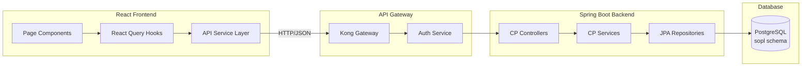
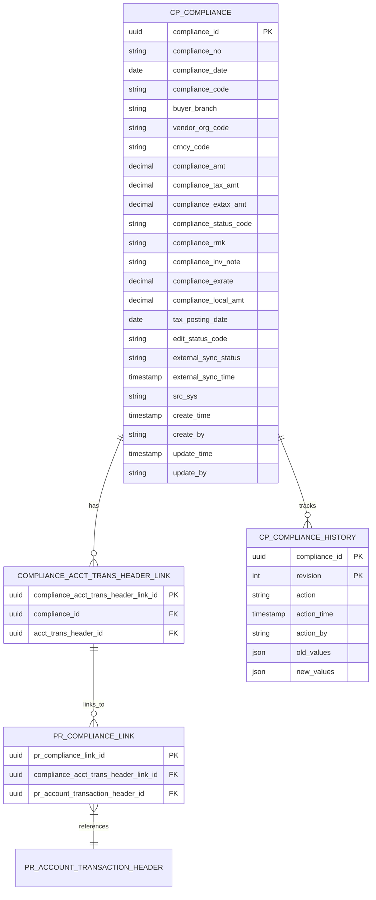
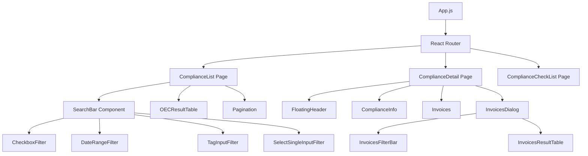

# Software Requirements Specification (SRS)
# CP Module - Compliance Processing

| Document Information | |
|---------------------|---|
| **Module Name** | CP - Compliance Processing |
| **Version** | 1.0 |
| **Last Updated** | 2025-11-26 |
| **Status** | Current |
| **Author** | System Analysis |

---

## Table of Contents
1. [Introduction](#1-introduction)
2. [Overall Description](#2-overall-description)
3. [System Architecture](#3-system-architecture)
4. [Functional Requirements](#4-functional-requirements)
5. [API Endpoints](#5-api-endpoints)
6. [Data Model](#6-data-model)
7. [Business Rules](#7-business-rules)
8. [User Interface Requirements](#8-user-interface-requirements)
9. [Integration Points](#9-integration-points)
10. [Security Requirements](#10-security-requirements)
11. [Performance Requirements](#11-performance-requirements)
12. [Error Handling](#12-error-handling)
13. [Dependencies](#13-dependencies)
14. [Glossary](#14-glossary)
15. [Frontend Architecture](#15-frontend-architecture)

---

## 1. Introduction

### 1.1 Purpose
The CP (Compliance Processing) module provides comprehensive compliance management functionality within the OECLIS (OEC Enterprise Logistics System). It enables users to create, manage, and track compliance records related to AP (Accounts Payable) and AR (Accounts Receivable) invoices with various compliance types including tax compliance (ETA, ETB, TXA, TXB) and FaPiao compliance (FDA, FDB).

### 1.2 Scope
This document covers:
- Compliance List Management (CP0100)
- Compliance Detail Management (CP0101)
- Invoice Check Functionality (CP0105/CP0106)
- Export/Download Features (CP0201)
- Full-stack implementation including React frontend and Spring Boot backend

### 1.3 Definitions and Acronyms

| Term | Definition |
|------|------------|
| CP | Compliance Processing |
| ETA | Electronic Tax A (8-digit compliance number) |
| ETB | Electronic Tax B (8-digit compliance number) |
| FDA | FaPiao Document A (20-digit compliance number) |
| FDB | FaPiao Document B (20-digit compliance number) |
| TXA | Tax Type A (8-digit compliance number) |
| TXB | Tax Type B (8-digit compliance number) |
| MBL | Master Bill of Lading |
| HBL | House Bill of Lading |
| PR | Payment Request |

### 1.4 References
- CLAUDE.md - System architecture documentation
- OECLIS API Documentation
- React Query Documentation
- Spring Boot 3.x Documentation

---

## 2. Overall Description

### 2.1 Product Perspective
The CP module is a sub-system of the OECLIS platform, integrating with:
- **Payment Request (PB) Module**: Links compliance records to payment requests
- **Account Transaction Module**: Associates invoices with compliance records
- **CargoWise Integration**: Fetches invoice and shipment data
- **User Authentication**: Microsoft Entra ID-based access control

### 2.2 Product Functions
1. **Compliance List View**: Search and browse compliance records with advanced filtering
2. **Compliance Create/Edit**: Full CRUD operations for compliance records
3. **Invoice Association**: Link AP/AR invoices to compliance records
4. **Status Management**: Track compliance status (Complete/Incomplete)
5. **Batch Operations**: Complete multiple compliance records simultaneously
6. **Invoice Verification**: Check invoice amounts against compliance totals
7. **Export Functionality**: Download compliance data in Excel format

### 2.3 User Classes and Characteristics

| User Role | Capabilities |
|-----------|-------------|
| **Standard User** | View, create, edit compliance records within assigned branches |
| **Accounting User** | Full access to all compliance functions including delete |
| **Administrator** | System-wide access and configuration |

### 2.4 Operating Environment
- **Backend**: Java 21, Spring Boot 3.0.13, PostgreSQL
- **Frontend**: React 18, Material-UI, Mantine 7.x, React Query
- **Authentication**: Microsoft Entra ID via Kong API Gateway
- **Deployment**: Kubernetes with Docker containers

---

## 3. System Architecture

### 3.1 Full-Stack Data Flow



### 3.2 Backend Architecture

```
oec.lis.sopl
├── controller/cp/
│   ├── CP0100Controller.java    # Compliance List operations
│   ├── CP0101Controller.java    # Compliance Detail CRUD
│   ├── CP0105Controller.java    # Invoice Amount Check (AP)
│   ├── CP0106Controller.java    # Invoice List Check
│   └── CP0201Controller.java    # Export/Download
├── service/cp/
│   ├── impl/
│   │   ├── CP0100ServiceImpl.java
│   │   ├── CP0101ReadServiceImpl.java
│   │   └── CP0101WriteServiceImpl.java
│   └── interfaces/
│       ├── CP0100Service.java
│       ├── CP0101ReadService.java
│       └── CP0101WriteService.java
└── model/cp/
    ├── CP010001RequestBean.java
    ├── CP010001ResponseBean.java
    ├── CP010101RequestBean.java
    ├── CP010101ResponseBean.java
    └── dao/
        ├── ComplianceDao.java
        ├── ComplianceHistoryDao.java
        └── po/
            ├── CompliancePo.java
            └── ComplianceHistoryPo.java
```

### 3.3 Frontend Architecture

```
sopl-frontend-release/src/
├── page/
│   ├── ComplianceList/index.js          # List page container
│   ├── ComplianceDetail/index.js        # Detail/Edit page container
│   └── ComplianceCheckList/index.js     # Invoice check page
├── pageComponents/
│   ├── ComplianceList/
│   │   ├── SearchBar/index.js           # Search filters
│   │   └── OECResultTable/index.js      # Data grid
│   ├── ComplianceDetail/
│   │   ├── ComplianceInfo.js            # Header information
│   │   ├── Invoices.js                  # Invoice list section
│   │   └── modal/
│   │       ├── InvoicesDialog.js        # Invoice selection modal
│   │       ├── InvoicesFilterBar.js     # Modal search filters
│   │       └── InvoicesResultTable.js   # Modal results table
│   └── ComplianceCheckList/
│       ├── CheckAmount.js
│       ├── CheckList.js
│       └── InvoiceAmount/
└── api/
    └── api_search.js                     # API service functions
```

---

## 4. Functional Requirements

### 4.1 FR-CP-001: Compliance List Search

**Description**: Users can search compliance records using multiple filter criteria.

**Acceptance Criteria**:
- Support filtering by: Status, Buyer Branch, Vendor, Compliance No., Type, Date Range, Currency, MBL No., HBL No., Request No., Invoice No.
- Results display in paginated table with configurable page size (10, 20, 50)
- Support column sorting (ascending/descending)
- Preserve last search criteria for user session
- Column visibility customization

**Input Parameters** (CP010001RequestBean):
| Field | Type | Validation | Description |
|-------|------|------------|-------------|
| pagination | RestPageRequest | Required | Page, size, sortBy, sortDir |
| companyCode | String[] | Optional | Company code filter |
| buyerBranchCode | String[] | Optional | Buyer branch filter |
| vendorOrgCode | String[] | Optional | Vendor organization code |
| currencyCode | String[] | Optional | Currency filter |
| mblNo | String[] | Optional | Master Bill of Lading numbers |
| hblNo | String[] | Optional | House Bill of Lading numbers |
| requestNo | String[] | Optional | Payment request numbers |
| invoiceNo | String[] | Optional | Invoice numbers |
| beginDate | String | Format: yyyy-MM-dd | Date range start |
| endDate | String | Format: yyyy-MM-dd | Date range end |
| complianceNo | String[] | Optional | Compliance number filter |
| complianceStatusCode | String[] | "C" or "I" | Status filter |
| complianceType | String[] | Optional | Type filter (ETA, ETB, FDA, FDB, TXA, TXB) |

### 4.2 FR-CP-002: Compliance Detail View

**Description**: Display detailed information for a single compliance record.

**Acceptance Criteria**:
- Show compliance header information (type, number, date, vendor, buyer, currency, amount)
- Display associated invoices with amounts
- Show payment request associations (when PR module enabled)
- Calculate and display total AP/AR amounts

### 4.3 FR-CP-003: Create New Compliance

**Description**: Users can create new compliance records.

**Acceptance Criteria**:
- Auto-generate compliance date as current date
- Validate compliance number format based on type:
  - ETA, ETB, TXA, TXB: 8 digits
  - FDA, FDB: 20 digits
- Require at least one invoice to be associated
- Validate vendor exists and is active
- Calculate compliance amount from tax and ex-tax amounts

### 4.4 FR-CP-004: Edit Compliance

**Description**: Users can modify existing incomplete compliance records.

**Acceptance Criteria**:
- Lock record during edit (prevent concurrent modification)
- Only allow editing of "Incomplete" status records
- Validate all fields on save
- Support cancel operation to release lock

### 4.5 FR-CP-005: Delete Compliance

**Description**: Users can delete incomplete compliance records.

**Acceptance Criteria**:
- Confirmation dialog before deletion
- Only delete "Incomplete" status records
- Remove all invoice associations
- Record deletion in audit log

### 4.6 FR-CP-006: Complete Compliance

**Description**: Mark compliance records as complete.

**Acceptance Criteria**:
- Support single and batch completion
- Validate all required fields before completion
- Change status from "I" (Incomplete) to "C" (Complete)
- Completed records become read-only

### 4.7 FR-CP-007: Invoice Inquiry

**Description**: Search and associate invoices with compliance records.

**Acceptance Criteria**:
- Search by Request No., Invoice No., HBL No., MBL No.
- Filter by AP/AR ledger type
- Display invoice amount, currency, and dates
- Prevent duplicate invoice associations
- Calculate total amounts by currency

### 4.8 FR-CP-008: Amount Validation

**Description**: Validate compliance amount matches invoice totals.

**Acceptance Criteria**:
- Compare compliance amount with total invoice amount
- Display warning if amounts don't match
- Allow user to proceed with confirmation
- Validate currency consistency

---

## 5. API Endpoints

### 5.1 CP0100 - Compliance List Operations

| Method | Endpoint | Description | Request Body | Response |
|--------|----------|-------------|--------------|----------|
| POST | `/cp0100/list` | Search compliance records | CP010001RequestBean | RestPageResponse<CP010001ResponseBean> |
| GET | `/cp0100/lastCriteria` | Get user's last search criteria | - | RestOneResponse<CP010001LastQueryBean> |

### 5.2 CP0101 - Compliance Detail Operations

| Method | Endpoint | Description | Request Body | Response |
|--------|----------|-------------|--------------|----------|
| GET | `/cp0101/hasPrModule` | Check if PR module is enabled | - | RestOneResponse<Boolean> |
| GET | `/cp0101/detail` | Get compliance detail (with PR) | complianceId (query) | RestOneResponse<CP010101ResponseBean> |
| GET | `/cp0101/detailWithoutRequest` | Get compliance detail (no PR) | complianceId (query) | RestOneResponse<CP010101ResponseBean> |
| POST | `/cp0101/save` | Create/Update compliance | CP010101RequestBean | RestOneResponse<String> |
| POST | `/cp0101/saveInfo` | Update compliance info only | CP010101RequestBean | RestOneResponse<String> |
| POST | `/cp0101/saveTaxPostingDate` | Update tax posting date | CP010105RequestBean | RestOneResponse<String> |
| POST | `/cp0101/delete` | Delete compliance | CP010102RequestBean | RestOneResponse<String> |
| POST | `/cp0101/complete` | Mark as complete | CP010104RequestBean | RestOneResponse<String> |
| POST | `/cp0101/edit` | Lock for editing | complianceId (body) | RestOneResponse<String> |
| POST | `/cp0101/cancel` | Release edit lock | complianceId (body) | RestOneResponse<String> |
| POST | `/cp0101/inquiry` | Search invoices (with PR) | CP010103RequestBean | RestOneResponse<CP010103ResponseBean> |
| POST | `/cp0101/inquiryWithoutRequest` | Search invoices (no PR) | CP010103RequestBean | RestOneResponse<CP010103ResponseBean> |
| POST | `/cp0101/arAmount` | Calculate AR amounts | invoiceList (body) | RestOneResponse<ArAmountResponseBean> |

### 5.3 CP0105/CP0106 - Invoice Check Operations

| Method | Endpoint | Description | Request Body | Response |
|--------|----------|-------------|--------------|----------|
| POST | `/cp0105/list` | Check invoice amounts | CP010501RequestBean | RestPageResponse<CP010501ResponseBean> |
| POST | `/cp0106/list` | Check invoice list | CP010601RequestBean | RestPageResponse<CP010601ResponseBean> |

### 5.4 CP0201 - Export Operations

| Method | Endpoint | Description | Request Body | Response |
|--------|----------|-------------|--------------|----------|
| POST | `/cp0201/download` | Export compliance data | CP020101RequestBean | Excel file (byte[]) |

---

## 6. Data Model

### 6.1 Entity Relationship Diagram



### 6.2 Database Table: cp_compliance

**Location**: PostgreSQL (sopl schema)

| Column | Type | Constraints | Description |
|--------|------|-------------|-------------|
| compliance_id | UUID | PK, NOT NULL | Unique identifier |
| compliance_no | VARCHAR(30) | NOT NULL | Compliance number |
| compliance_date | DATE | | Compliance date |
| compliance_code | VARCHAR(10) | | Type code (ETA, ETB, FDA, FDB, TXA, TXB) |
| buyer_branch | VARCHAR(3) | | Buyer branch code |
| vendor_org_code | VARCHAR(12) | | Vendor organization code |
| crncy_code | VARCHAR(3) | | Currency code |
| compliance_amt | DECIMAL(19,4) | | Total compliance amount |
| compliance_tax_amt | DECIMAL(19,4) | | Tax amount |
| compliance_extax_amt | DECIMAL(19,4) | | Ex-tax amount |
| compliance_status_code | VARCHAR(10) | | Status: C=Complete, I=Incomplete |
| compliance_rmk | VARCHAR(1000) | | Remark |
| compliance_inv_note | TEXT | | Invoice note |
| compliance_exrate | DECIMAL(18,9) | | Exchange rate |
| compliance_local_amt | DECIMAL(19,4) | | Local currency amount |
| tax_posting_date | DATE | | Tax posting date |
| edit_status_code | VARCHAR(1) | | Edit lock status: Y=Locked, N=Available |
| external_sync_status | VARCHAR(20) | NOT NULL | External sync status |
| external_sync_time | TIMESTAMP | | Last sync timestamp |
| src_sys | VARCHAR(20) | | Source system |
| create_cmpny | VARCHAR(3) | | Created by company |
| create_branch | VARCHAR(3) | | Created by branch |
| create_dept | VARCHAR(3) | | Created by department |
| create_by | VARCHAR(50) | | Created by user |
| create_time | TIMESTAMP | | Creation timestamp |
| update_cmpny | VARCHAR(3) | | Updated by company |
| update_branch | VARCHAR(3) | | Updated by branch |
| update_dept | VARCHAR(3) | | Updated by department |
| update_by | VARCHAR(50) | | Updated by user |
| update_time | TIMESTAMP | | Update timestamp |

---

## 7. Business Rules

### 7.1 BR-CP-001: Compliance Number Validation
- **Rule**: Compliance number format depends on compliance type
- **Logic**:
  - ETA, ETB, TXA, TXB: Must be exactly 8 digits
  - FDA, FDB: Must be exactly 20 digits
- **Implementation**: Validated in frontend (`checkSave()`) and backend (`CP0101WriteServiceImpl`)

### 7.2 BR-CP-002: Edit Lock Management
- **Rule**: Only one user can edit a compliance record at a time
- **Logic**:
  - When user clicks "Edit", call `/cp0101/edit` to acquire lock
  - Set `edit_status_code = 'Y'`
  - On save or cancel, release lock with `/cp0101/cancel`
  - Display warning if record is locked by another user

### 7.3 BR-CP-003: Completion Restrictions
- **Rule**: Only incomplete compliance records can be completed
- **Logic**:
  - `compliance_status_code` must be 'I'
  - All required fields must be populated
  - At least one invoice must be associated

### 7.4 BR-CP-004: Amount Consistency
- **Rule**: Compliance amount should match total invoice amount
- **Logic**:
  - Calculate total from associated invoices by currency
  - Compare with compliance amount
  - Display warning if mismatch (user can override)

### 7.5 BR-CP-005: Delete Restrictions
- **Rule**: Only incomplete compliance records can be deleted
- **Logic**:
  - `compliance_status_code` must be 'I'
  - Remove all invoice associations before deletion

---

## 8. User Interface Requirements

### 8.1 UI-CP-001: Compliance List Page

**Route**: `/complianceList`

**Components**:
| Component | File Path | Description |
|-----------|-----------|-------------|
| Container | `/page/ComplianceList/index.js` | Page wrapper with state management |
| SearchBar | `/pageComponents/ComplianceList/SearchBar/index.js` | Filter components |
| OECResultTable | `/pageComponents/ComplianceList/OECResultTable/index.js` | Data grid |

**Features**:
- Floating header with breadcrumb navigation
- Search filters: Status, Buyer, Vendor, Compliance No., Type, Date Range, Currency, MBL No., HBL No., Request No., Invoice No.
- Action buttons: Check Invoice, Complete (batch), New
- Paginated results table with sorting
- Row selection for batch operations
- Column visibility toggle

**Table Columns**:
| Column | Field | Sortable | Selectable |
|--------|-------|----------|------------|
| Status | complianceStatusCodeDesc | Yes | No |
| Buyer | buyerBranchCode | Yes | No |
| Vendor Name | vendorOrgCode | Yes | Yes |
| Compliance No. | complianceNo | Yes | No |
| Type | complianceTypeDesc | Yes | No |
| Compliance Date | complianceDate | Yes | Yes |
| Currency | currencyCode | Yes | Yes |
| Amount | complianceAmount | Yes | No |
| Invoice Count | invoiceCount | Yes | Yes |
| Request No. | requestNo | Yes | Yes |
| MBL No. | mblNo | Yes | Yes |
| HBL No. | hblNo | Yes | Yes |
| Invoice No. | invoiceNo | Yes | Yes |
| Full Name | vendorCnCompanyName | Yes | Yes |
| Compliance Info | complianceInfo | Yes | Yes |
| Remark | remark | Yes | Yes |

### 8.2 UI-CP-002: Compliance Detail Page

**Route**: `/complianceDetail`

**Components**:
| Component | File Path | Description |
|-----------|-----------|-------------|
| Container | `/page/ComplianceDetail/index.js` | Page wrapper with CRUD operations |
| ComplianceInfo | `/pageComponents/ComplianceDetail/ComplianceInfo.js` | Header form |
| Invoices | `/pageComponents/ComplianceDetail/Invoices.js` | Invoice list section |
| InvoicesDialog | `/pageComponents/ComplianceDetail/modal/InvoicesDialog.js` | Invoice selection modal |

**Modes**:
1. **Create Mode**: New compliance with empty form
2. **View Mode**: Read-only display
3. **Edit Mode**: Editable form with validation

**Form Fields**:
| Field | Type | Required | Validation |
|-------|------|----------|------------|
| Compliance Type | Dropdown | Yes | ETA, ETB, FDA, FDB, TXA, TXB |
| Compliance No. | Text | Yes | 8 or 20 digits based on type |
| Compliance Date | Date | Yes | Valid date |
| Buyer | Dropdown | Yes | Valid branch |
| Vendor | Autocomplete | Yes | Valid organization |
| Currency | Dropdown | Yes | Valid currency |
| Ex-tax Amount | Number | Yes | Numeric |
| Tax Amount | Number | Yes | Numeric |
| Total Amount | Calculated | - | Auto-calculated |
| Exchange Rate | Number | No | Numeric |
| Local Amount | Number | No | Numeric |
| Tax Posting Date | Date | No | Valid date |
| Compliance Info | Text | No | Max 1000 chars |
| Remark | Text | No | Max 1000 chars |

---

## 9. Integration Points

### 9.1 Payment Request (PB) Module
- **Purpose**: Link compliance records to payment requests
- **Endpoints Used**:
  - Check PR module availability: `GET /cp0101/hasPrModule`
  - Query with payment requests: `POST /cp0101/inquiry`
- **Data Flow**: Compliance -> PR_COMPLIANCE_LINK -> PR_ACCOUNT_TRANSACTION_HEADER -> PAYMENT_REQUEST_HEADER

### 9.2 Account Transaction Module
- **Purpose**: Associate invoices with compliance records
- **Tables**:
  - `at_account_transaction_header`
  - `at_account_transaction_lines`
- **Data Flow**: Compliance -> COMPLIANCE_ACCT_TRANS_HEADER_LINK -> AT_ACCOUNT_TRANSACTION_HEADER

### 9.3 CargoWise Integration
- **Purpose**: Fetch invoice and shipment data
- **Connection**: SQL Server (cargowise datasource)
- **Tables**:
  - `AccTransactionHeader`
  - `AccTransactionLines`
  - `JobCharge`

### 9.4 Reference Data
- **Purpose**: Get dropdown options for UI
- **Endpoints**: `POST /masterCode/search`
- **Options**: complianceCode, currency, vendor, pbBranch

---

## 10. Security Requirements

### 10.1 Authentication
- **Method**: JWT token via Microsoft Entra ID
- **Gateway**: Kong API Gateway with auth_service upstream
- **Token Validation**: Each request validated against Microsoft Entra ID

### 10.2 Authorization
- **Method**: Role-based access control (RBAC)
- **Annotations**: `@PreAuthorize` on controller methods
- **User Context**: Extracted from JWT token

### 10.3 Data Access Control
- **Branch Filtering**: Users can only access data within their assigned branches
- **Company Filtering**: Data filtered by user's company code
- **Edit Locking**: Prevents concurrent modification

---

## 11. Performance Requirements

### 11.1 Response Time
| Operation | Target | Max |
|-----------|--------|-----|
| List Search | < 500ms | 2s |
| Detail View | < 300ms | 1s |
| Save Operation | < 1s | 3s |
| Export | < 5s | 30s |

### 11.2 Concurrent Users
- Support 100+ concurrent users
- Connection pooling via HikariCP

### 11.3 Data Volume
- Pagination required for lists > 10 records
- Maximum page size: 50 records

---

## 12. Error Handling

### 12.1 Frontend Error Handling

```javascript
// React Query error handling pattern
const { mutate } = useMutation(postCP0101Save, {
  onError: (error) => {
    handleErrorMessage(error);
    console.log("API(postCP0101Save) fetch error: ", error);
  },
  onSuccess: (data) => {
    if (handleApiErrorMessage(data.msg, data.status) === false) {
      return;
    }
    // Success handling
  },
});
```

### 12.2 Backend Error Handling

| Error Code | Description | HTTP Status |
|------------|-------------|-------------|
| 200 | Success | 200 |
| 400 | Validation Error | 400 |
| 401 | Unauthorized | 401 |
| 403 | Forbidden | 403 |
| 404 | Not Found | 404 |
| 409 | Conflict (Record Locked) | 409 |
| 500 | Internal Server Error | 500 |

### 12.3 Common Error Scenarios

| Scenario | Error Message | Resolution |
|----------|---------------|------------|
| Record locked by another user | "Record is being edited by {user}" | Wait or contact user |
| Invalid compliance number | "Compliance number format invalid" | Correct format based on type |
| Missing required fields | "Required field {field} is missing" | Fill in required field |
| Amount mismatch | "Amount doesn't match invoice total" | Confirm or correct amount |

---

## 13. Dependencies

### 13.1 Backend Dependencies

| Dependency | Version | Purpose |
|------------|---------|---------|
| Spring Boot | 3.0.13 | Application framework |
| Spring Data JPA | 3.0.x | Data access |
| PostgreSQL Driver | 42.x | Database connectivity |
| Hibernate | 6.x | ORM |
| Apache POI | 5.x | Excel export |
| Lombok | 1.18.x | Code generation |

### 13.2 Frontend Dependencies

| Dependency | Version | Purpose |
|------------|---------|---------|
| React | 18.x | UI framework |
| React Query | 3.x | Server state management |
| Material-UI | 4.x | UI components (legacy) |
| Mantine | 7.x | UI components (modern) |
| React Router | 5.x | Navigation |
| Axios | 1.x | HTTP client |
| dayjs | 1.x | Date handling |
| i18next | 23.x | Internationalization |

---

## 14. Glossary

| Term | Definition |
|------|------------|
| Compliance | A record tracking tax or FaPiao documentation for invoices |
| Complete | Final status indicating all required information is captured |
| Incomplete | Draft status allowing further editing |
| FaPiao | Chinese official invoice/receipt document |
| Edit Lock | Mechanism to prevent concurrent editing |
| Buyer Branch | The OEC branch responsible for the compliance |
| Vendor | The external organization related to the compliance |

---

## 15. Frontend Architecture

### 15.1 Component Hierarchy



### 15.2 State Management

| State Type | Technology | Usage |
|------------|------------|-------|
| Server State | React Query | API data caching and synchronization |
| Local State | useState | Component-level state |
| Form State | useState | Form field values |
| Navigation State | React Router | Page navigation and URL params |
| Global Context | AppContext | User info, notifications |

### 15.3 API Service Layer Mapping

| Frontend Function | API Endpoint | Usage |
|-------------------|--------------|-------|
| `postSearchCP0100List` | `POST /cp0100/list` | Search compliance list |
| `getCP0100LastCriteria` | `GET /cp0100/lastCriteria` | Get last search criteria |
| `getCP0101HasPrModule` | `GET /cp0101/hasPrModule` | Check PR module enabled |
| `getCP0101Detail` | `GET /cp0101/detail` | Get detail with PR |
| `getCP0101DetailNoPR` | `GET /cp0101/detailWithoutRequest` | Get detail without PR |
| `postCP0101Save` | `POST /cp0101/save` | Create/Update compliance |
| `postCP0101Delete` | `POST /cp0101/delete` | Delete compliance |
| `postSearchCP0101Complete` | `POST /cp0101/complete` | Mark as complete |
| `postCP0101Edit` | `POST /cp0101/edit` | Acquire edit lock |
| `postCP0101Cancel` | `POST /cp0101/cancel` | Release edit lock |
| `postCP0101Inquiry` | `POST /cp0101/inquiry` | Search invoices |
| `postCP0101InquiryNoPR` | `POST /cp0101/inquiryWithoutRequest` | Search invoices (no PR) |
| `postCP0101ArAmount` | `POST /cp0101/arAmount` | Calculate AR amounts |

### 15.4 React Query Configuration

```javascript
// Typical query usage in ComplianceList
const { data, mutate, isLoading, isSuccess } = useMutation(
  postSearchCP0100List,
  {
    onError: (error) => {
      handleErrorMessage(error);
    },
    onSuccess: (data) => {
      if (handleApiErrorMessage(data.msg, data.status) === false) {
        return;
      }
      // Process successful response
    },
  }
);

// Typical query for detail page
const { data, refetch } = useQuery(
  ["getCP0101Detail", complianceId],
  getCP0101Detail,
  {
    refetchOnWindowFocus: false,
    enabled: false, // Manual trigger
    onSuccess: (data) => {
      // Process response
    },
  }
);
```

### 15.5 Form Validation (Frontend)

```javascript
// Validation function in ComplianceDetail
const checkSave = () => {
  // Required field validation
  if (!detail.complianceType ||
      !detail.complianceNo ||
      !detail.vendor ||
      !detail.buyer ||
      !detail.currencyCode ||
      !detail.complianceAmount ||
      Number(detail.complianceAmount) == 0
  ) return true;

  // Compliance number format validation by type
  if ((detail.complianceType === "ETA" ||
       detail.complianceType === "ETB" ||
       detail.complianceType === "TXA" ||
       detail.complianceType === "TXB") &&
      detail.complianceNo.length !== 8
  ) return true;

  if ((detail.complianceType === "FDA" ||
       detail.complianceType === "FDB") &&
      detail.complianceNo.length !== 20
  ) return true;

  // Invoice requirement
  if (!(invoiceData?.length > 0)) return true;

  return false; // Validation passed
}
```

---

## Document History

| Version | Date | Author | Changes |
|---------|------|--------|---------|
| 1.0 | 2025-11-26 | System Analysis | Initial document creation |

---

*End of Document*
